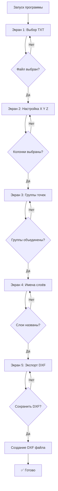

# План разработки: Geodezia TXT to DXF Converter

## 1. Общая архитектура программы

```
┌─────────────────────────────────────────────────────────────┐
│                    Geodezia Wizard                          │
│                                                             │
│  ┌─────────────────────────────────────────────────────┐   │
│  │                    Главное окно                      │   │
│  │  ┌───────────────────────────────────────────────┐  │   │
│  │  │            Область контента (Frame)           │  │   │
│  │  │  ┌─────────────────────────────────────────┐  │  │   │
│  │  │  │        Текущий экран мастера             │  │  │   │
│  │  │  │  (1 из 5: Welcome, Format, Groups, Layers, Export)  │  │   │
│  │  │  └─────────────────────────────────────────┘  │  │   │
│  │  └───────────────────────────────────────────────┘  │   │
│  │  ┌───────────────────────────────────────────────┐  │   │
│  │  │         Кнопки навигации                      │  │   │
│  │  │  [Назад]                    [Далее/Сохранить]  │  │   │
│  │  └───────────────────────────────────────────────┘  │   │
│  └─────────────────────────────────────────────────────┘   │
│                                                             │
│  ┌─────────────────────────────────────────────────────┐   │
│  │              Внутреннее состояние                   │   │
│  │  - txt_file_path: str                              │   │
│  │  - txt_data: List[dict]  # все строки из файла     │   │
│  │  - column_mapping: dict  # {col_index: 'X'/'Y'/'Z'} │   │
│  │  - groups: List[dict]  # исходные + итоговые группы │   │
│  │  - layers: List[dict]  # группа + имя слоя DXF     │   │
│  └─────────────────────────────────────────────────────┘   │
└─────────────────────────────────────────────────────────────┘
```

## 2. Структура файлов проекта

```
geodezia/
├── main.py                    # Точка входа, запуск приложения
├── app.py                     # Класс приложения (Tkinter)
├── wizard.py                  # Мастер экранов (switch_screen)
├── screens/
│   ├── __init__.py
│   ├── screen1_welcome.py     # Экран 1: Загрузка TXT
│   ├── screen2_format.py      # Экран 2: Настройка координат
│   ├── screen3_groups.py       # Экран 3: Объединение групп
│   ├── screen4_layers.py       # Экран 4: Имена слоёв DXF
│   └── screen5_export.py       # Экран 5: Экспорт DXF
├── utils/
│   ├── __init__.py
│   ├── txt_parser.py          # Парсинг TXT файла
│   ├── dxf_exporter.py         # Экспорт в DXF (ezdxf)
│   └── validators.py           # Валидация данных
├── data/
│   └── sample.txt             # Пример файла для тестов
└── requirements.txt           # Зависимости: ezdxf
```

## 3. Логика работы экранов

### Экран 1: Загрузка TXT
```
Пользователь → Нажимает "Выбрать TXT файл"
    ↓
Проверка: файл существует? это TXT?
    ↓
Парсинг: читаем ВСЕ строки файла
    ↓
Показываем статус: ✅ TXT загружен
    ↓
Активируем кнопку "Далее"
```

### Экран 2: Настройка координат
```
Показываем первые N строк файла как пример
    ↓
Пользователь выбирает колонки для X, Y, Z через выпадающие списки
    ↓
Валидация:
    - X, Y, Z выбраны?
    - X, Y, Z разные колонки?
    ↓
При нажатии "Далее":
    - определяем буквенную часть имён точек
    - создаём список исходных групп
    - переходим к Экрану 3
```

### Экран 3: Объединение групп
```
Показываем таблицу:
    Исходная группа | Итоговая группа (по умолчанию = исходной)
    ─────────────────────────────────────────
    K               | K
    NIZR            | NIZR
    ST              | ST
    ...
    ↓
Пользователь может:
    - редактировать "Итоговая группа"
    - ввести одинаковое имя для нескольких исходных групп
    ↓
При нажатии "Далее":
    - формируем уникальный список итоговых групп
    - создаём соответствие: группа → слой DXF
    - переходим к Экрану 4
```

### Экран 4: Имена DXF-слоёв
```
Показываем таблицу:
    Итоговая группа | Имя слоя DXF (по умолчанию = итоговой)
    ─────────────────────────────────────────
    K               | K
    NIZR_RIGEL      | NIZR_RIGEL
    ...
    ↓
Пользователь может переименовать слои
    ↓
При нажатии "Далее":
    - сохраняем маппинг: группа → слой
    - переходим к Экрану 5
```

### Экран 5: Экспорт DXF
```
Показываем: [Сохранить DXF]
    ↓
Пользователь выбирает путь и имя файла
    ↓
Создаём DXF через ezdxf:
    - создаём модели (layers) из таблицы
    - для каждой точки:
        определяем слой по итоговой группе
        добавляем POINT на слой
    ↓
Показываем результат:
    ✅ DXF успешно создан
    или
    ❌ Ошибка: описание
```

## 4. Модуль парсинга TXT

```python
# utils/txt_parser.py

def parse_txt(file_path: str) -> List[dict]:
    """Парсит TXT файл тахеометрической съёмки."""
    results = []
    with open(file_path, 'r', encoding='utf-8') as f:
        for line_num, line in enumerate(f, 1):
            # Убираем пробелы, проверяем на пустоту
            line = line.strip()
            if not line:
                continue
            
            # Разделяем по запятой, убираем пустые значения
            parts = [p.strip() for p in line.split(',') if p.strip()]
            
            # Пропускаем строки без данных
            if len(parts) < 4:
                continue
            
            results.append({
                'line_num': line_num,
                'raw_line': line,
                'columns': parts,
                'name': parts[0],  # Имя точки всегда из первой колонки
            })
    
    return results


def extract_group(name: str) -> str:
    """Извлекает буквенную часть из имени точки.
    
    K1 → K
    K150 → K
    NIZR12 → NIZR
    RIG45 → RIG
    """
    import re
    match = re.match(r'^([A-Za-z]+)', name)
    return match.group(1) if match else name
```

## 5. Модуль экспорта DXF

```python
# utils/dxf_exporter.py

import ezdxf
from ezdxf.layouts import Modelspace


def create_dxf(
    output_path: str,
    points_data: List[dict],
    column_mapping: dict,
    layer_mapping: dict,
    point_type: str = 'POINT'  # или 'CIRCLE'
) -> bool:
    """Создаёт DXF файл с точками.
    
    Args:
        output_path: Путь к выходному DXF файлу
        points_data: Список словарей с данными точек
        column_mapping: {'X': 1, 'Y': 2, 'Z': 3} - индексы колонок
        layer_mapping: {'K': 'K', 'NIZR': 'NIZR_RIGEL'} - группа → слой
        point_type: 'POINT' или 'CIRCLE'
    """
    # Создаём новый DXF документ (R2000)
    doc = ezdxf.new('R2000')
    msp = doc.modelspace()
    
    # Создаём слои из layer_mapping
    for layer_name in set(layer_mapping.values()):
        doc.layers.add(layer_name)
    
    # Добавляем точки
    for point in points_data:
        x = float(point['columns'][column_mapping['X']])
        y = float(point['columns'][column_mapping['Y']])
        z = float(point['columns'][column_mapping['Z']])
        
        # Определяем слой
        group = extract_group(point['name'])
        layer = layer_mapping.get(group, group)
        
        if point_type == 'POINT':
            msp.add_point((x, y, z), dxfattribs={'layer': layer})
        else:  # CIRCLE
            msp.add_circle((x, y), radius=0.05, dxfattribs={'layer': layer})
            msp.add_point((x, y, z), dxfattribs={'layer': layer})
    
    # Сохраняем
    doc.saveas(output_path)
    return True
```

## 6. Класс приложения (Tkinter)

```python
# app.py

import tkinter as tk
from wizard import WizardApp


class GeodeziaApp:
    """Главное приложение Geodezia."""
    
    def __init__(self):
        self.root = tk.Tk()
        self.root.title("Geodezia - TXT to DXF Converter")
        self.root.geometry("600x500")
        self.root.resizable(False, False)
        
        # Иконка (опционально)
        # self.root.iconbitmap('geodezia.ico')
        
        # Внутреннее состояние
        self.state = {
            'txt_file_path': None,
            'txt_data': [],
            'column_mapping': {},  # {'X': 0, 'Y': 1, 'Z': 2}
            'groups': [],           # [{'original': 'K', 'merged': 'K'}, ...]
            'layer_mapping': {},    # {'K': 'K', 'NIZR': 'NIZR_RIGEL'}
        }
        
        # Запускаем мастер
        self.wizard = WizardApp(self.root, self.state)
        self.wizard.show_screen(1)  # Первый экран
        
        self.root.mainloop()


if __name__ == '__main__':
    GeodeziaApp()
```

## 7. Мастер экранов

```python
# wizard.py

import tkinter as tk
from tkinter import ttk
from screens import (
    Screen1Welcome,
    Screen2Format,
    Screen3Groups,
    Screen4Layers,
    Screen5Export,
)


class WizardApp:
    """Мастер экранов (wizard)."""
    
    SCREENS = {
        1: Screen1Welcome,
        2: Screen2Format,
        3: Screen3Groups,
        4: Screen4Layers,
        5: Screen5Export,
    }
    
    def __init__(self, root, state):
        self.root = root
        self.state = state
        self.current_screen = 1
        
        # Контейнер для экранов
        self.container = ttk.Frame(root)
        self.container.pack(fill='both', expand=True, padx=20, pady=20)
        
        # Кнопки навигации
        self.btn_frame = ttk.Frame(root)
        self.btn_frame.pack(fill='x', padx=20, pady=(0, 20))
        
        self.btn_back = ttk.Button(
            self.btn_frame,
            text="Назад",
            command=self.go_back,
            state='disabled'
        )
        self.btn_back.pack(side='left')
        
        self.btn_next = ttk.Button(
            self.btn_frame,
            text="Далее",
            command=self.go_next,
            state='disabled'
        )
        self.btn_next.pack(side='right')
    
    def show_screen(self, screen_num):
        """Показывает указанный экран."""
        # Очищаем контейнер
        for widget in self.container.winfo_children():
            widget.destroy()
        
        self.current_screen = screen_num
        
        # Создаём экран
        screen_class = self.SCREENS[screen_num]
        screen = screen_class(self.container, self.state, self)
        screen.pack(fill='both', expand=True)
        
        # Обновляем кнопки
        self.update_nav_buttons()
    
    def go_next(self):
        """Переход к следующему экрану."""
        if self.current_screen < 5:
            self.show_screen(self.current_screen + 1)
    
    def go_back(self):
        """Переход к предыдущему экрану."""
        if self.current_screen > 1:
            self.show_screen(self.current_screen - 1)
    
    def update_nav_buttons(self):
        """Обновляет состояние кнопок навигации."""
        # Кнопка "Назад"
        self.btn_back['state'] = 'normal' if self.current_screen > 1 else 'disabled'
        
        # Кнопка "Далее"
        if self.current_screen == 5:
            self.btn_next['text'] = 'Сохранить DXF'
            self.btn_next['state'] = 'normal'
        else:
            self.btn_next['text'] = 'Далее'
            self.btn_next['state'] = self.state.get('can_go_next', 'disabled')
    
    def set_can_go_next(self, can_go):
        """Устанавливает возможность перехода к следующему экрану."""
        self.state['can_go_next'] = 'normal' if can_go else 'disabled'
        self.update_nav_buttons()
```

## 8. Зависимости

```txt
# requirements.txt
ezdxf>=0.17.0
```

## 9. Сборка в EXE

```bash
# Требования для PyInstaller
pyinstaller --onefile --windowed --name "Geodezia" main.py

# Или с иконкой
pyinstaller --onefile --windowed --icon=geodezia.ico --name "Geodezia" main.py
```

## 10. Тестовый файл

```txt
# data/sample.txt
K1,100.5,200.3,50.2,
K2,105.2,198.7,51.0,
K3,110.8,205.1,49.5,
NIZR4,500.1,300.4,45.0,
NIZR5,505.3,295.2,44.8,
NIZRIG6,510.0,310.0,46.2,
NIZRIG7,515.2,305.5,45.9,
ST8,200.0,400.0,55.0,
ST9,205.5,398.2,54.7,
```

---

## Поток работы пользователя



---

**План готов. Переключаюсь в режим Code для реализации.**
